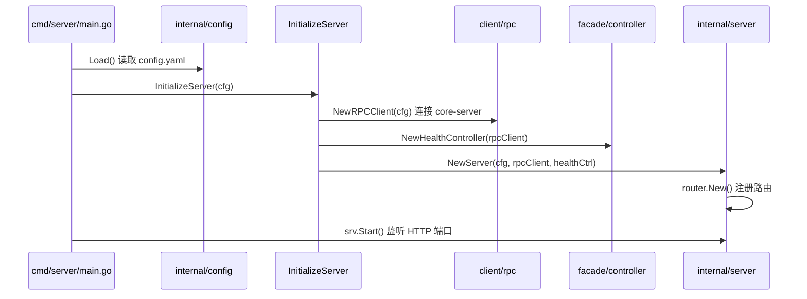
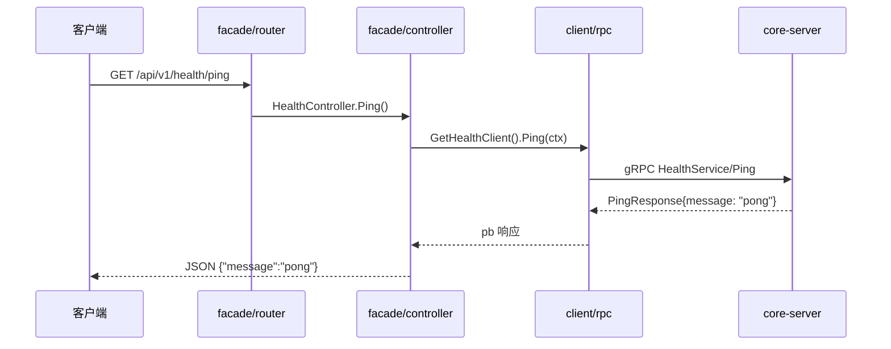

# gateway

Renai 项目的 HTTP 网关，对外暴露 REST API，通过 gRPC 转发请求到 `core-server` 等下游服务。

## 技术栈

| 类别 | 技术 | 说明 |
|------|------|------|
| 语言 | Go 1.26 | |
| HTTP 框架 | [Gin](https://gin-gonic.com/) | 路由、中间件、JSON 响应 |
| RPC 客户端 | [gRPC](https://grpc.io/) | 调用 core-server，默认 `127.0.0.1:8081` |
| 接口定义 | Protocol Buffers | 与 core-server 共享同一份 proto 契约 |
| 依赖注入 | [Google Wire](https://github.com/google/wire) | 编译期 DI，生成 `cmd/server/wire_gen.go` |
| 配置 | YAML | `gopkg.in/yaml.v3` 读取 `config/config.yaml` |
| 错误聚合 | hashicorp/go-multierror | RPC 连接关闭时合并多个错误 |

> **数据库**：gateway 本身**不连接数据库**，无状态设计，所有持久化操作由下游 gRPC 服务（如 core-server）完成。

## 快速启动

```bash
# 1. 先启动 core-server（127.0.0.1:8081）
# 2. 再启动 gateway

cd gateway
go mod tidy
make wire                  # 重新生成依赖注入代码（可选）
make generate-health-rpc   # 修改 proto 后重新生成 pb 代码
go run ./cmd/server
```

验证 Health 接口：

```bash
curl http://127.0.0.1:8080/api/v1/health/ping
# 期望: {"message":"pong"}
```

## 目录结构

```
gateway/
├── cmd/
│   └── server/                     # 服务入口
│       ├── main.go                 # 加载配置 → Wire 初始化 → 启动 HTTP → 优雅关闭
│       ├── wire.go                 # Wire 注入定义
│       └── wire_gen.go             # Wire 自动生成（勿手改）
├── config/
│   └── config.yaml                 # HTTP 端口、RPC 地址、超时配置
├── docs/
│   └── proto/                      # Protobuf 源文件（与 core-server 对齐）
│       └── health.proto
├── internal/
│   ├── config/                     # 配置加载
│   │   ├── config.go               # Config / ServerConfig，Load()
│   │   └── conf_rpc.go             # RPCConfig（地址 + 超时）
│   ├── client/                     # 下游 gRPC 客户端
│   │   ├── wire.go
│   │   └── rpc/
│   │       ├── rpcclient.go        # 统一 RPC Client，管理连接与各 pb Client
│   │       └── core_rpc/
│   │           └── healthpb/       # protoc 生成的 pb / grpc 客户端代码
│   ├── facade/                     # HTTP 接入层（MVC 中的 C + 路由）
│   │   ├── wire.go
│   │   ├── router/
│   │   │   └── router.go           # Gin 路由注册
│   │   └── controller/
│   │       └── health_ctrl.go      # Health HTTP Handler
│   ├── model/
│   │   └── reponse/                # HTTP 响应 DTO
│   │       └── health.go
│   └── server/                     # HTTP Server 生命周期
│       ├── server.go               # 启停、优雅关闭、释放 RPC 连接
│       └── wire.go
├── Makefile
├── go.mod
└── go.sum
```

## 分层职责

```
┌─────────────────────────────────────────┐
│  facade/router     HTTP 路由分发         │
├─────────────────────────────────────────┤
│  facade/controller HTTP Handler         │
├─────────────────────────────────────────┤
│  model/reponse     JSON 响应结构         │
├─────────────────────────────────────────┤
│  client/rpc        gRPC 客户端聚合       │
└─────────────────────────────────────────┘
         │ gRPC
         ▼
    core-server
```

- **facade**：对外 HTTP 接口，负责参数解析、调用 RPC、组装 JSON 响应。
- **client/rpc**：统一管理下游 gRPC 连接与各 Service Client。
- **server**：HTTP Server 生命周期（Listen、Shutdown、关闭 RPC 连接）。

## 启动与跳转逻辑

### 服务启动链路



Wire 注入顺序（`wire_gen.go`）：

1. `rpc.NewRPCClient(cfg)` — 建立到 core-server 的 gRPC 连接，初始化各 pb Client
2. `controller.NewHealthController(client)` — 注入 RPC Client
3. `server.NewServer(cfg, client, healthController)` — 创建 Gin Engine 并注册路由

### Health Ping 完整跳转链路

以 `GET /api/v1/health/ping` 为例：



代码跳转：

```
HTTP 请求
  → internal/facade/router/router.go           v1.GET("/health/ping", health.Ping)
  → internal/facade/controller/health_ctrl.go  设置超时 → 调用 gRPC
  → internal/client/rpc/rpcclient.go           GetHealthClient().Ping()
  → core-server internal/rpc/health_rpc.go     返回 pong
  → internal/model/reponse/health.go           封装 JSON 响应
```

### RPC Client 设计

`rpcclient.go` 采用统一 Client 管理所有下游连接：

```go
type Client struct {
    coreConnection *grpc.ClientConn       // gRPC 连接
    healthClient   healthpb.HealthServiceClient  // 各 Service Client
    requestTimeout time.Duration          // 请求超时
}
```

新增下游 RPC 时：

1. 在 `docs/proto/` 添加 proto，`make generate-health-rpc` 生成到 `core_rpc/xxxpb/`
2. 在 `rpcclient.go` 的 `Client` 结构体中增加对应 Client 字段
3. 在 `NewRPCClient` 中初始化，并提供 `GetXxxClient()` Getter
4. 在 `facade/controller/` 新增 Controller，在 `router.go` 注册路由

## 配置说明

```yaml
server:
  addr: "127.0.0.1:8080"    # HTTP 监听地址
  mode: debug               # Gin 模式：debug | release | test

rpc:
  core_server_addr: "127.0.0.1:8081"   # core-server gRPC 地址
  request_timeout: 5                    # gRPC 调用超时（秒）
```

## 与 core-server 的关系

```
浏览器 / 前端
    │  HTTP :8080
    ▼
  gateway  ── gRPC :8081 ──►  core-server ── MySQL ──►  renai 数据库
```

| 服务 | 协议 | 默认端口 | 数据库 |
|------|------|----------|--------|
| gateway | HTTP (Gin) | 8080 | 无 |
| core-server | gRPC | 8081 | MySQL |

## 常用命令

| 命令 | 说明 |
|------|------|
| `go run ./cmd/server` | 启动网关 |
| `make wire` | 重新生成 Wire 注入代码 |
| `make generate-health-rpc` | 从 health.proto 生成 gRPC 客户端代码 |
| `make generate-proto-rpc` | 同上（别名） |
